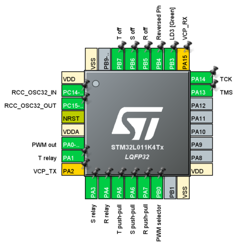

# RST Generator

First attempt with [STM32](https://www.st.com/en/microcontrollers-microprocessors/stm32-32-bit-arm-cortex-mcus.html) ARM Cortex-M Micro-Controllers Units (MCU's) using a [Nucleo-32 L011K4](https://www.st.com/content/st_com/en/products/evaluation-tools/product-evaluation-tools/mcu-mpu-eval-tools/stm32-mcu-mpu-eval-tools/stm32-nucleo-boards/nucleo-l011k4.html) evaluation board and the [STM32CubeIDE](https://www.st.com/en/development-tools/stm32cubeide.html) development environment (at version 1.6, including [STM32CubeMX](https://www.st.com/en/development-tools/stm32cubemx.html) for peripheral initialization code generation and management)

Project stored for reference as this project is included in a larger context not described here

Which aspects of the MCU (an [STM32L011K4](https://www.st.com/en/microcontrollers-microprocessors/stm32l011k4.html)) are used in this project:

- Independent Watchdog enabled and kicked in `main` routine
- PWM generation with interruption on Timer 2, PWM at 5 kHz on channel 1 (PA0)
- Timer 21 used for controlling 6 GPIO's as push-pull outputs upon an interrupt fired every 3.33 ms
- Five GPIO's as inputs with internal pull-ups for controlling the internal logic managed in Timer 21 interrupt
- LD3 (green LED) on Nucleo board used as a pulse indication that firmware is running (during some seconds after startup flash is long on / short off then it turns to short on / log off)

**Important note**: as PB6 and PB7 are used as outputs, straps SB16 and SB18 must be removed and left open

